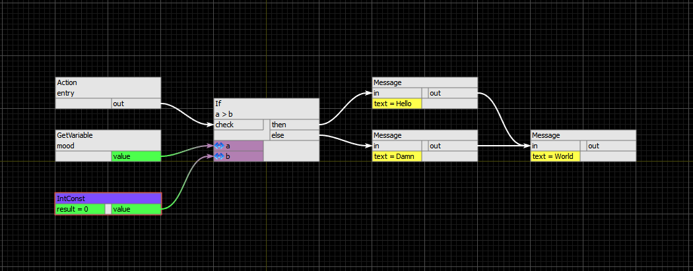

# AnandamideEditor

Anandamide script is flexible diagram-based scripting language. Powerful library system provides flexible add-on support for your application and allows simple and fast feature development. Based on simple idea, this programming language is easy for understanding of basic principles and leads to lower cost of developemet for the business logic of your application.

## Video Channel

https://www.youtube.com/playlist?list=PLqmaFsEpxcUUgcmjs-EN4xG8_cWeB7sG1

 

## Building under Windows
* Ensure you are using QT Creator 5.6+
* Checkout repository of AnandamideEditor
* Update submodules
* Build AnandamideEditor/depend/AnandamideAPI/project/AnandamideAPI.pro
* Build AnandamideEditor/project/AnandamideEditor.pro
* Run AnandamideEditor/bin/AnandamideEditor_*.exe
